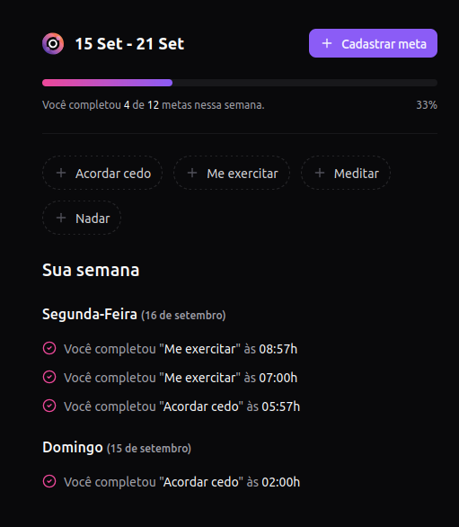
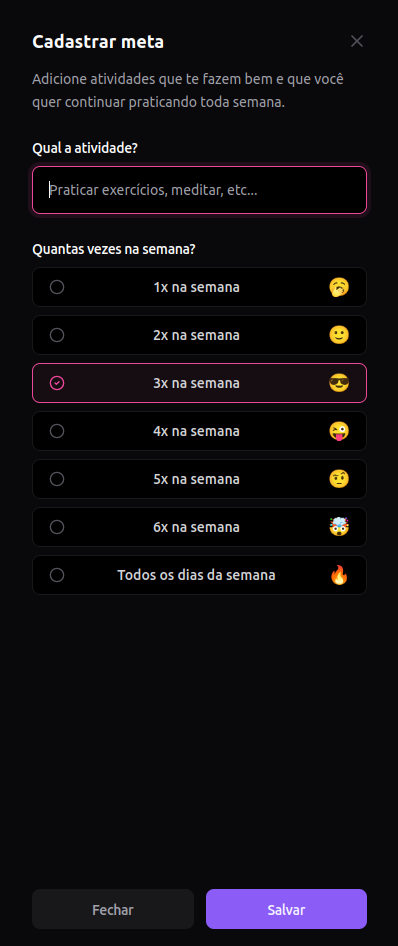
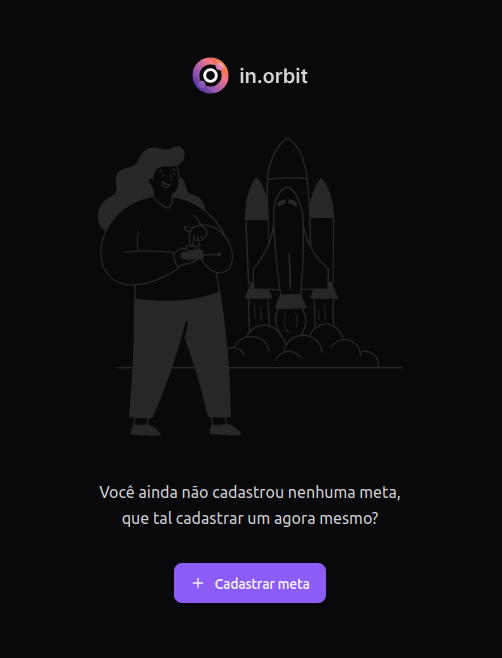

<h1 align="center">
  
</h1>

<h4 align="center">
  🚀 Next Level Week Pocket Javascript
</h4>

## 💻 Projeto

Projeto desenvolvido com base nas aulas do evento **Next Level Week Pocket Javascript**, oferecido pela [Rocketseat][rocketseat].

## 🛠 Tecnologias

As seguintes tecnologias foram utilizadas no desenvolvimento do projeto:

- [Node.js][nodejs]
- [React][reactjs]

## 📷 Screenshots

<kbd>
  
</kbd>

<kbd>
  
</kbd>

<kbd>
  
</kbd>

[rocketseat]: https://rocketseat.com.br/
[nodejs]: https://nodejs.org/en/
[reactjs]: https://reactjs.org/
